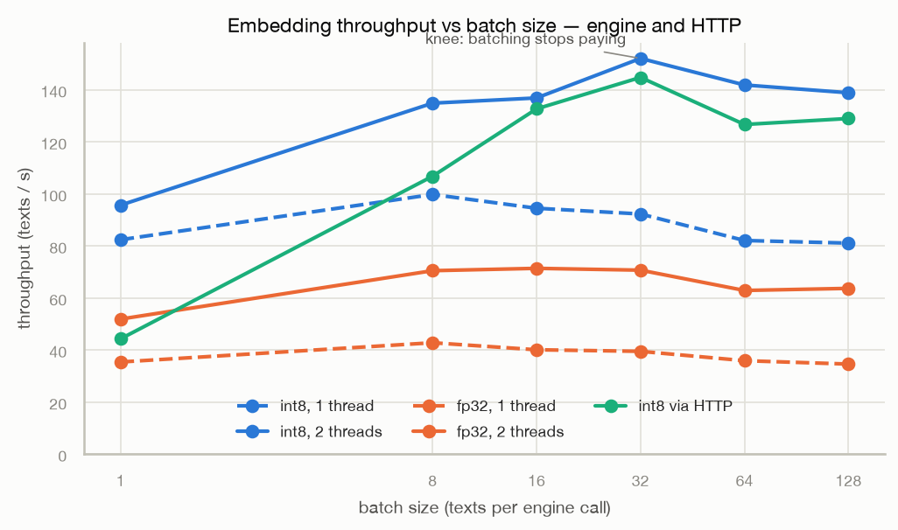
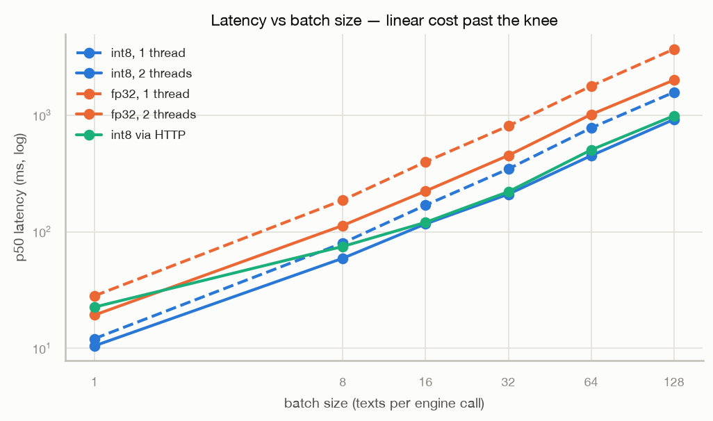
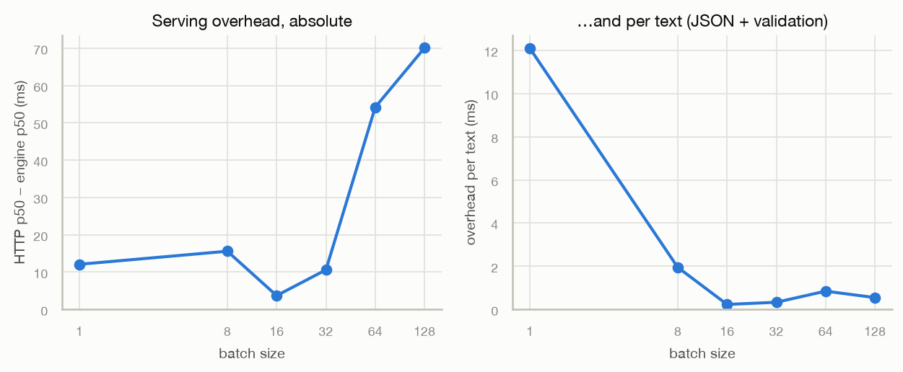
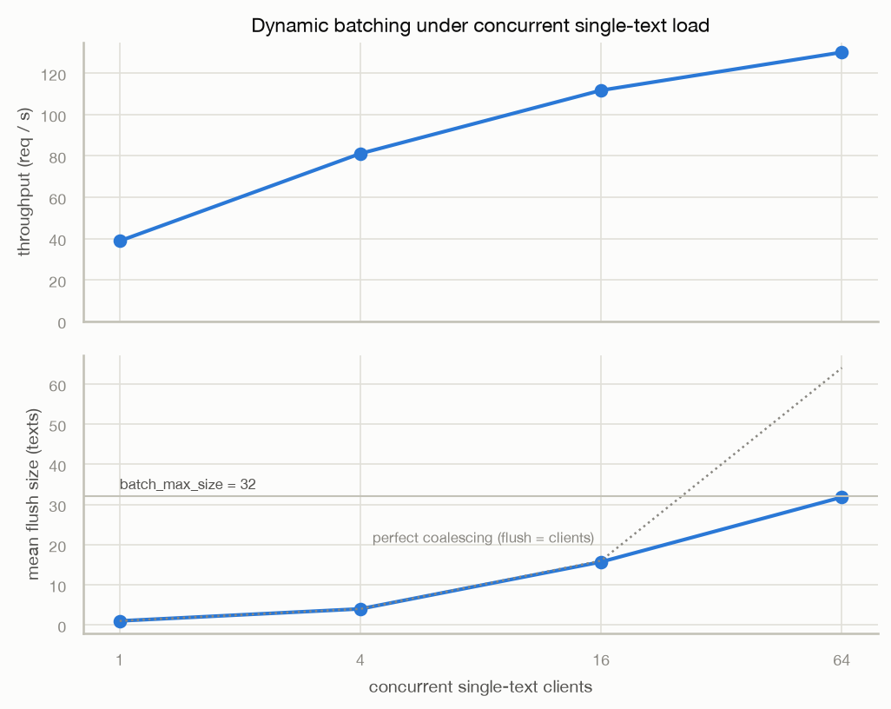
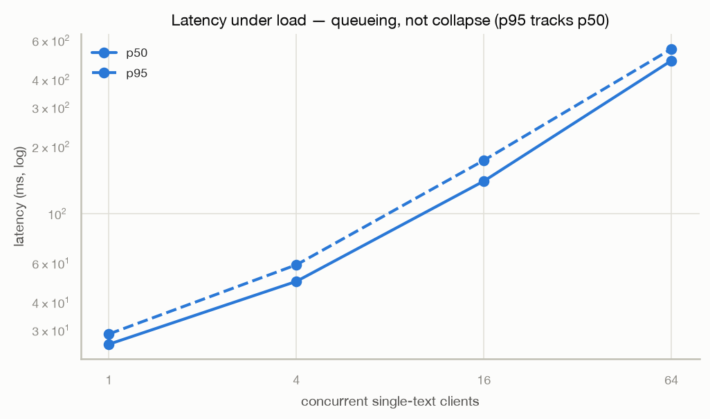
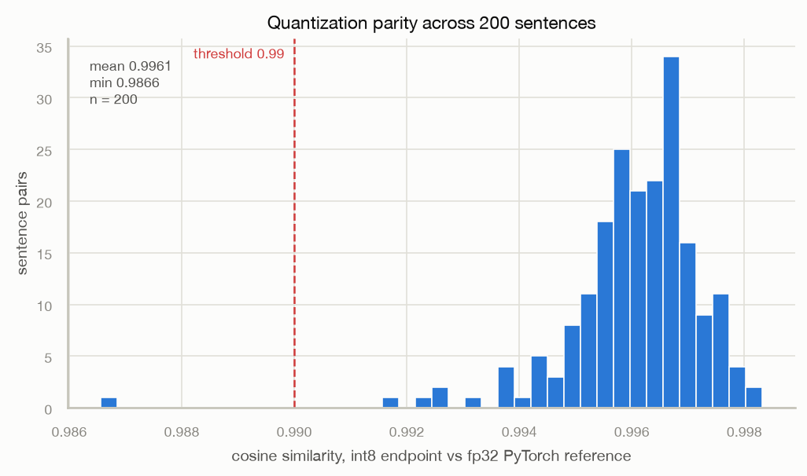
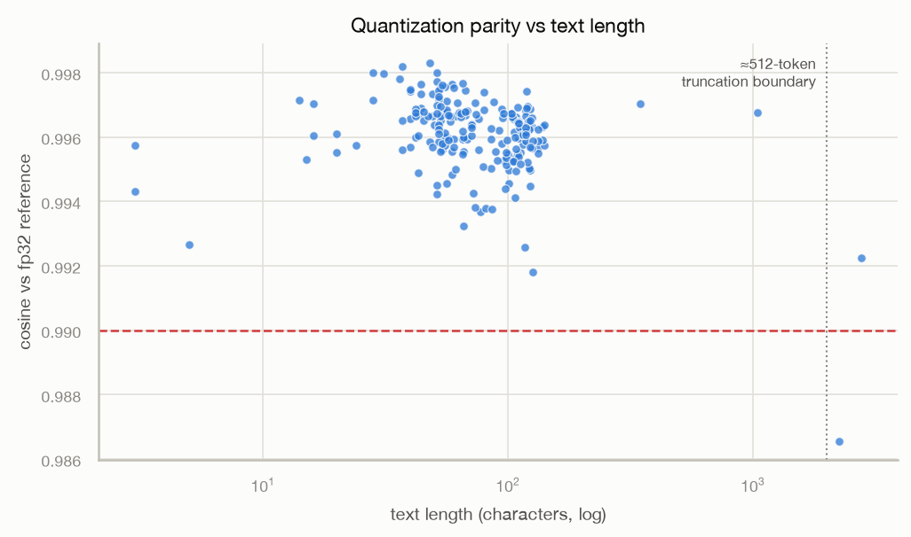
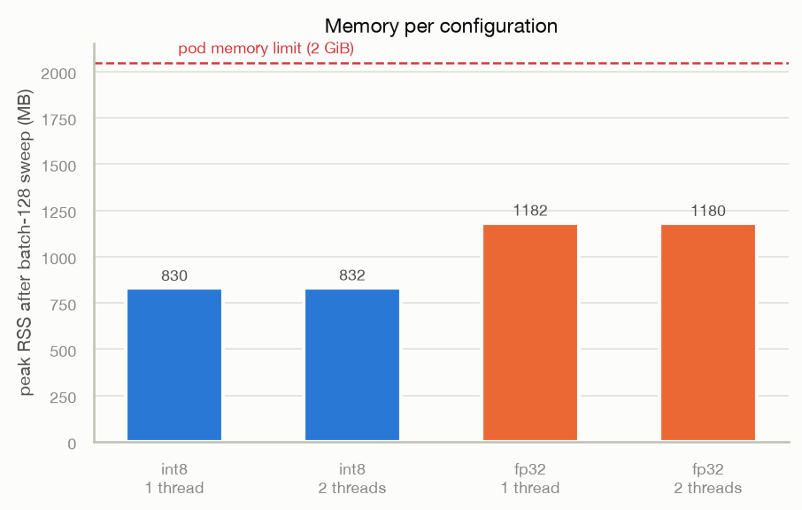

# Benchmarks — the full picture

One dataset, collected 2026-08-01 with `scripts/benchmark_suite.py` (label
`amd-vnni-v1`, raw data in `results/amd-vnni-v1.json`). Serving image
`fa440dd`, model `e5-small-avx512vnni-v1`, pod on the AMD EPYC Genoa embed
node at cpu limit 2 / `INTRA_OP_NUM_THREADS=2`. Numbers-only write-ups:
[benchmarks-1.2.md](benchmarks-1.2.md) (engine),
[benchmarks-1.3.md](benchmarks-1.3.md) (HTTP).

## Reproduce

```bash
# on a pod on the serving node (needs the fp32 export copied in)
python benchmark.py --model-path /models/onnx-int8,/tmp/onnx-fp32 --json engine.json
# on a client pod in the cluster
python benchmark_http.py --url http://rag-embedder.rag.svc --json http.json
# locally: parity + merge + figures
uv run python scripts/benchmark_suite.py --url https://<endpoint> --parity \
    --ingest engine.json http.json --label <label> --out results/<label>.json
uv run python scripts/plot_benchmarks.py results/<label>.json --out docs/figures
```

## Throughput



int8 with 2 threads leads everywhere and peaks at 152 texts/s at batch 32 —
the knee. The HTTP curve tracks the engine curve closely; at the knee the
whole serving stack costs ~5%.



Past the knee, latency is linear in batch size for every configuration
(parallel lines on the log-log plot). Bigger batches buy nothing after 32.

## Serving overhead



The HTTP-minus-engine difference: ~12ms at batch 1 (dominated by the 10ms
batch-wait window), settling to ~0.5ms per text at larger batches — JSON
serialization and response validation, not inference.

## Dynamic batching under load



The batcher's proof: as concurrent single-text clients grow 1 → 64, the mean
flush size climbs along the perfect-coalescing line until it saturates at
`batch_max_size` 32, and throughput scales 38.8 → 130 req/s (~3.4×).



Latency under load grows as queueing (offered load beyond capacity), not
collapse: p95 stays a constant factor above p50 at every level.

## Quantization quality



200 sentences, int8 endpoint vs fp32 PyTorch reference. Gate: p5 ≥ 0.99,
mean ≥ 0.994. The per-channel model passes with mean 0.9961 / p5 0.9941.



The lowest cosines belong to degenerate inputs (`"12345"`) and texts past the
512-token truncation boundary. Realistic chunk-sized text sits ≥ 0.992.

## Memory



Peak RSS after a batch-128 sweep. int8 ~832MB, fp32 ~1180MB. ORT's arena
grows with the largest batch seen and does not shrink.

## Datasets

- `results/amd-vnni-v1.json` — this run (AMD EPYC Genoa embed pool)
- `results/tuned-v2.json` — earlier run of the same suite on an Intel
  (AVX-512 without VNNI) cluster; kept for cross-ISA comparison
